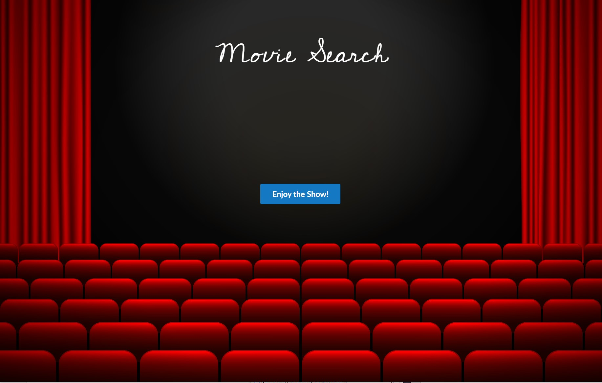
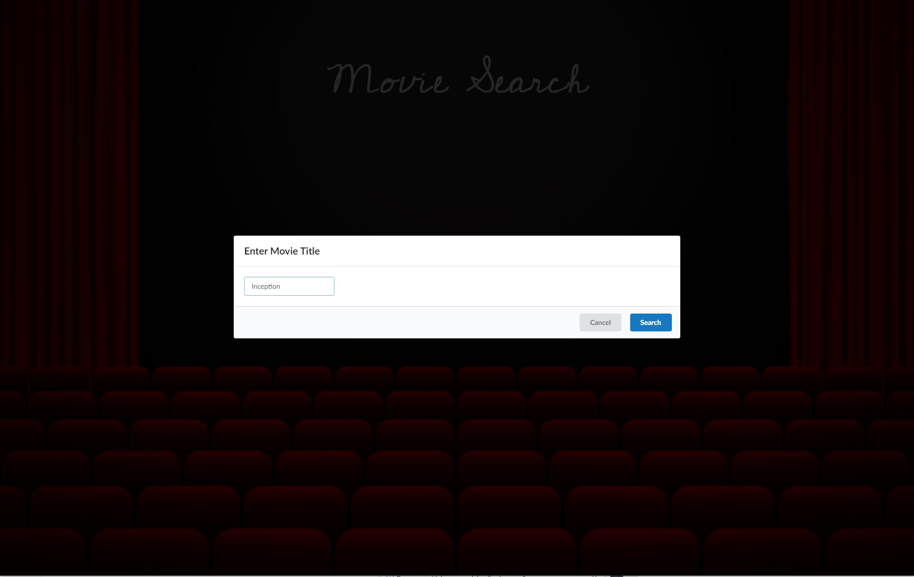
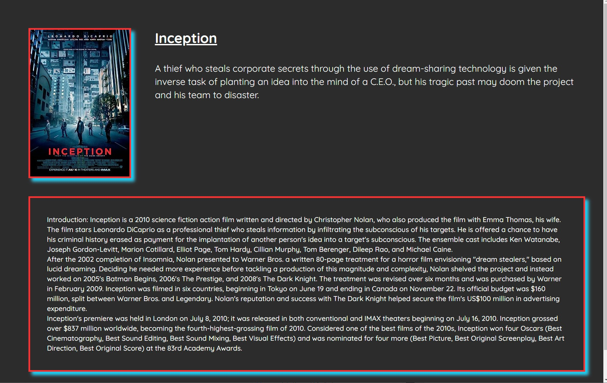

## Movie Search

## Description
This repository contains the source code for a Movie Search web application. Users can search for movies by title and view their details including the plot, poster, and title through OMDB. The introduction is extracted from Wikipedia.

## Code Highlights 
* HTML
* CSS
* Fomantic UI: A community fork of the popular Semantic-UI framework.
* Google Font API
* Javascript 
* OMDB API
* Wikipedia API

## Demo 
Demo App: [https://sam-cowman.github.io/Movie-Search/](https://sam-cowman.github.io/Movie-Search/)

## Setup
Clone the repository: git clone <https://github.com/Sam-Cowman/Movie-Search>

Open index.html in your web browser to run the application.

## Usage
Enter the title of the movie you want to search for in the search input.
Click on the "Enjoy the Show!" button to initiate the search.
View the movie details including title, plot, and poster.
An introduction about the movie will also be displayed if available.

## Credits
* This project utilizes data from the OMDB API for movie information.
* Introduction about movies is extracted from the Wikipedia API.
* Background image by Starline on Freepik
Source: [Red Movie Theater Seats with Curtains Background](https://www.freepik.com/free-vector/red-movie-theater-seats-with-curtains-background_26689100.htm#query=movie%20theater%20background&position=1&from_view=keyword&track=ais&uuid=38beea86-6030-4c72-9b4b-c1c7d4271be1)

## License
No License 

